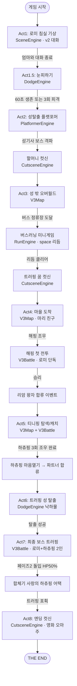

# 01. Act 플로우 (8 Act 전체 흐름)

> 이 문서의 목적: 사랑의 하츄핑 UNIFIED v4의 8개 Act 전체 진행 흐름, 각 Act의 엔진/트리거/전환 조건을 한눈에 파악한다.

---

## 1. 전체 흐름도 (Mermaid)

---

## 2. Act별 상세 표

| Act | 이름 | 주 엔진 | 플레이 시간(분) | 트리거 조건 | onComplete 다음 |
|---|---|---|---|---|---|
| 1 | 로미 침실 기상 | SceneEngine (v2 대화) | 3~5 | 게임 시작 | Act1.5 |
| 1.5 | 눈피하기 | DodgeEngine | 1~2 | Act1 대화 종료 | Act2 |
| 2 | 성탈출 플랫포머 + 성기사 보스 | PlatformerEngine + CutsceneEngine | 8~12 | Act1.5 60초 생존 or 3회 피격 | Act3 |
| 3 | 오버월드 + 버스러닝 + 꿈 | V3Map + RunEngine + CutsceneEngine | 5~7 | Act2 보스 격파 → 할머니 컷신 종료 | Act4 |
| 4 | 마을 도착 + 해핑 첫 전투 + 리암 합류 | V3Map + V3Battle | 4~6 | Act3 꿈 컷신 종료 | Act5 |
| 5 | 티니핑 탐색/캐치 + 하츄핑 3회 조우 | V3Map + V3Battle | 10~15 | 해핑 전투 승리 + 리암 합류 | Act6 |
| 6 | 트러핑 성 탈출 (낙하물 회피) | DodgeEngine (별빛대모험식) | 3~4 | 하츄핑 파트너 합류 완료 | Act7 |
| 7 | 최종 보스 트러핑 (로미+하츄핑 2인) | V3Battle (특수 모드) | 5~8 | Act6 탈출 성공 | Act8 |
| 8 | 엔딩 컷신 | CutsceneEngine | 2~3 | 트러핑 포획 | 게임 종료 |

**총 예상 플레이 시간: 40~60분**

---

## 3. Act 전환 Dispatcher 규칙

`STATE.mode` 값을 기준으로 `core/dispatcher.js`가 해당 엔진에 프레임 라우팅.

| STATE.mode | 라우팅 대상 |
|---|---|
| `scene` | SceneEngine |
| `dodge` | DodgeEngine |
| `platformer` | PlatformerEngine |
| `run` | RunEngine |
| `overworld` | V3Map |
| `battle` | V3Battle |
| `cutscene` | CutsceneEngine |

각 엔진의 `onComplete(nextMode, payload)` 콜백이 `STATE.mode`를 변경하여 다음 Act 진입.

---

## 4. 골든패스 체크리스트

처음부터 끝까지 **정상 플레이**가 성립하는 최소 시나리오. QA는 이 리스트를 순서대로 통과해야 한다.

- [ ] **Act1 시작**: 로미 침실 로드, 엄마 NPC와 대화 트리거
- [ ] **Act1 완료**: 대화 종료 → Act1.5 자동 전환
- [ ] **Act1.5 시작**: 눈송이 파티클 생성, 로미 좌우 이동 가능
- [ ] **Act1.5 완료**: 60초 생존 또는 체력 0 → Act2 전환
- [ ] **Act2 플랫포머**: 로미 점프/이동, 성 내부 배경(BG_CASTLE_INTERIOR) 로드
- [ ] **Act2 보스전**: 성기사 등장, HP 바 표시, 3페이즈 패턴
- [ ] **Act2 컷신**: 보스 격파 → 할머니 등장 컷신 → Act3 전환
- [ ] **Act3 오버월드**: BG_FOUNTAIN_PLAZA, 버스 정류장 마커 표시
- [ ] **Act3 버스러닝**: 스페이스바 리듬 입력, 미스 3회 이하 통과
- [ ] **Act3 꿈 컷신**: 트러핑 실루엣 등장, Act4 자동 전환
- [ ] **Act4 마을**: 마리 NPC 대화, 해핑 조우 이벤트 트리거
- [ ] **Act4 첫 전투**: **로미 단독** 전투 UI, 해핑 격파
- [ ] **Act4 리암 합류**: 왕자 합류 이벤트, 파티 UI 업데이트
- [ ] **Act5 탐색**: BG_FOREST_BRIGHT/DEEP/DARK 순차 진입
- [ ] **Act5 캐치**: 부끄핑/아자핑/차차핑 중 2종 이상 포획 성공
- [ ] **Act5 하츄핑**: 3회 조우 이벤트 (도망→도망→마음열기) 순서 발화
- [ ] **Act5 파트너**: 하츄핑 파티 합류 → 서포트 효과 표시
- [ ] **Act6 탈출**: 낙하물 30초 회피, 트러핑 성 탈출 성공
- [ ] **Act7 페이즈1**: 로미 단독 턴, 트러핑 HP 50%까지 삭감
- [ ] **Act7 페이즈2**: 하츄핑 합류, 2인 번갈아 턴
- [ ] **Act7 필살**: "사랑의 하츄핑 어택" 합체기 발동, 트러핑 포획
- [ ] **Act8 엔딩**: 엔딩 컷신 재생, 크레딧 표시, 게임 종료

---

## 5. 플로우 제어 메모

- **세이브 포인트**: 각 Act 시작 시 `STATE.saveCheckpoint(actId)` 호출
- **Act 스킵(디버그)**: `?act=5` URL 파라미터 지원 예정
- **뒤로가기 금지 구간**: Act1.5, Act6, Act7 (진행형 씬)
- **되돌아가기 허용**: Act3 오버월드, Act5 탐색
